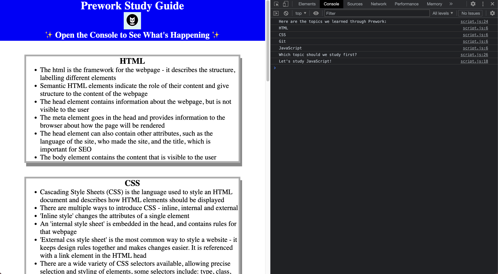

# Prework Study Guide Webpage

## Description
This study guide was created for bootcamp students who were going through the course pre-work. It contains notes on HTML, CSS, git and JavaScript

## Installation

There are no installation requirements for this website.

## Usage

To use the study guide, review the notes in each section. 
Suggestions for what to study next can be found in Chrome DevTools – press Command+Option+I (MacOS) or Command+Shift+I (Windows) to open the console. 

## Credits

This webpage was made by following the Prework modules in the sdX and Department for Education, Skills for Life Front End Development Bootcamp, delivered by Trilogy Education Services.

## License

Please refer to the LICENCE in the repo.

---